# Bookmark Manager

The website will have the following specification:

* Show a list of bookmarks
* Add new bookmarks
* Delete bookmarks
* Update bookmarks
* Comment on bookmarks
* Tag bookmarks into categories
* Filter bookmarks by tag
* Users are restricted to manage only their own bookmarks

# How to setup the databse

Install PostgreSQL via Homebrew:
```
brew install postgresql
```
Allow Homebrew to run Postgres in the background
```
brew services start postgresql
```
Enter psql:
```
    > psql
user=# 
```
Create a new database
```
user=# CREATE DATABASE bookmark_manager
```
Check it was created
```
user=# \l
```
Connect to the database
```
user=# \c bookmark_manager;
```
Inspect list of tables
```
user=# \dt
```
Should return 'No relations found.'

Create a new table
```
bookmark_manager=# CREATE TABLE bookmarks(id SERIAL PRIMARY KEY, url VARCHAR(60));
```
To ```SELECT```(view) all existing data in the table run:
```
bookmark_manager=# SELECT * FROM bookmarks;
```
This should return
```
id | url
---+------
(0 rows)
```
```INSERT``` bookmark data
```
bookmark_manager=# INSERT INTO bookmarks (url) VALUES ('http://www.makersacademy.com');
```
This can be used to ```DELETE``` items from the database:
```
bookmark_manager=# DELETE FROM bookmarks WHERE url = 'http://www.twitter.com';
```
And to ```UPDATE```:
```
bookmark_manager=# UPDATE bookmarks SET url = 'http://www.destroyallsoftware.com' WHERE url = 'http://www.askjeeves.com';
```
Download and install TablePlus.
It will need to know some things about your Postgres server:
- Where it is - ```localhost```, on ```Port 5432```.
- Login details - computers name as a ```username``` and no password
- Database to start with - ```bookmark_manager``` database.

Now create a new test database following the same process above, with the name 'bookmark_manager_test'.
```
user=# CREATE TABLE bookmarks(id SERIAL PRIMARY KEY, url VARCHAR(60));
user=# \c bookmark_manager_test;
bookmark_manager_test=# CREATE TABLE bookmarks(id SERIAL PRIMARY KEY, url VARCHAR(60));
```

# How to start building this application from scratch
First I created a new repository on GitHub.

Then on my mac in my command line I did the following:
```
mkdir bookmark-manager
cd bookmark-manager
echo "# bookmark-manager" >> README.md
git init
git add README.md
git commit -m "first commit"
git remote add origin git@github.com:tommyrharper/bookmark-manager.git
git push -u origin master
```
Then I ran the following my my projects root directory 'bookmark-manager' via the terminal:
```
git init
bundle init
rspec --init
```
I added the following dependencies to the Gemfile:
```
gem 'capybara'
gem 'rspec'
gem 'rubocop'
gem 'simplecov'
gem 'simplecov-console'
gem 'sinatra'
```
Run bundle to install dependencies, and set up file system.
```
bundle
mkdir app
touch app/bookmark_manager.rb
mkdir app/views
touch app/views/index.erb
touch config.ru
mkdir lib
```
Add to bookmark_manager.rb
```ruby
require 'sinatra/base'

class BookmarkManager < Sinatra::Base

  get '/' do
    erb :index
  end

  run! if app_file == $0
end
```
Add to config.ru
```ruby
require_relative './bookmark_manager/bookmark_manager.rb'
run BookmarkManager
```
Add to index.erb
```
Hello World
```
Run:
```
rackup
```
Visit in browser:
```
localhost:9292
````
Hello World should now be working.

But we are not finished yet.

Now we need to update spec/spec_helper.rb by adding the following code at the top of the file:
```ruby
require 'capybara'
require 'capybara/rspec'
require 'rspec'
require 'simplecov'
require 'simplecov-console'
require File.join(File.dirname(__FILE__), '../app', 'bookmark_manager.rb')

Capybara.app = BookmarkManager

SimpleCov.formatter = SimpleCov::Formatter::MultiFormatter.new([
  SimpleCov::Formatter::Console,
  # Want a nice code coverage website? Uncomment this next line!
  # SimpleCov::Formatter::HTMLFormatter
])
SimpleCov.start
```
Later BUT NOT  YET we will need to add the following to ensure functionality on the test database:
```ruby
require_relative './setup_test_database'

ENV['ENVIRONMENT'] = 'test' = 'test' # This line allows rspec to test only our test database

RSpec.configure do |config|
  config.before(:each) do
    setup_test_database
  end
end

```
run rspec to ensure it works
```
rspec
```
Hopefully you will get this response:
```ruby
Finished in 0.00062 seconds (files took 0.782 seconds to load)
0 examples, 0 failures


COVERAGE: 100.00% -- 0/0 lines in 0 files
```
Lets also change rubocop's settings:
```
touch .rubocop.yml
```
Then add to .rubocop.yml
```ruby
inherit_from:
  - https://raw.githubusercontent.com/makersacademy/scaffolint/v1.1.0/.rubocop.yml
```
Okay you are now ready to go!

# User Story

```
As a user,
So that I know what bookmarks I have
I would like to see a list of bookmarks
```

# Domain model

Objects | Messages
--------|------
bookmark| @name <br/> @url
bookmars| @bookmarks

